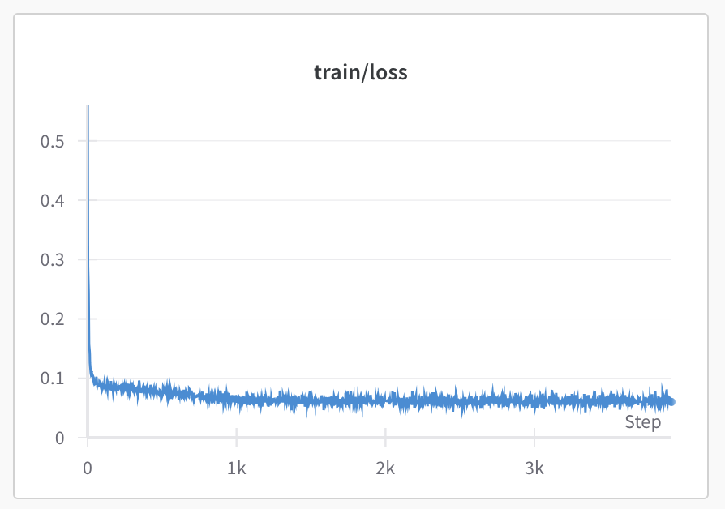
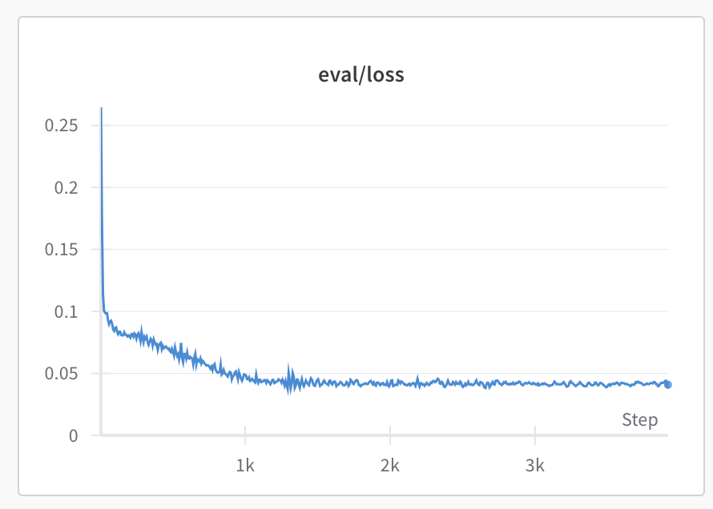

# AI-Generated Choreography - from Solos to Duets

## Introduction
This is the submission for GSoC [AI-Enabled Choreography](https://humanai.foundation/gsoc/2024/proposal_ChoreoAI1.html). In this project, I trained a generative model using VAE + LSTM layers to generate new sequences of a dancer.

## Part 1: Visualize the data
I followed [this repo](https://github.com/mariel-pettee/choreo-graph/blob/main/functions/plotting.py) to visualize motion capture [data](https://github.com/mariel-pettee/choreo-graph/tree/main/data). The code provides visualization of `seq` and `ghost` in a 3D space, which is convenient for us to view the difference between original sequence and generated sequence.

## Part 2: Train a generative model
### Model selection
I utilized VAE structure with LSTM layers. The reason why I choose this structure is that LSTM is suitable for processing sequential data and can learn the long-term dependencies. Compared to LSTM, GNN is more suitable for processing graph-structured data. Our motion capture data do have “joints” and edge information of the body, but the two main reasons why I didn’t use GNN are: 1) Our task primarily focuses on generating sequential data, not the relationship between different joints; 2) GNN will have much higher computational demand than LSTM due to computation of adjacency matrix.

I trained two modelw using static images and sequences separately. Currently, the model which uses static images of the dancer outperforms the one that uses sequential data, likely due to GPU usage limit of school’s cluster. I acknowledge that the output sequences show jittery behavior and require further optimization.

### Data processing
- Data preprocessing: center all data
- 70% train data, 15% validation data, 15% test data
- `seq_len=64`, no overlap

### Model design
The model contains an encoder and a decoder, where the encoder consists 2 LSTM layers, 2 linear layers for mean and log variance in the latent space. In the decoder, I designed a linear layer with ReLU activation, 2 LSTM layers, and an output smooth layer.

In both encoder and decoder, I tested different values of `latent_dim` and `n_units`, beginning with 32. Finally I choose `latent_dim` to be 256 and `n_units` to be 394. 

I also used the reparameterization trick to reformulate the sampling step into a differentiable operation. 

Furthermore, I tested with adding rotation layer to achieve data augmentation, but it showed no performance improvement. Also, due to time limit and GPU memory limit, I could only train with non-overlapping data with `seq_len=64`.

Two separate models with `seq_len=64` and `seq_len=1` were trained with MSE loss and KL divergence loss. The model was trained with `500` epochs with Adam optimizer and multi-step learning rate scheduler when `seq_len=64`, and trained with `200` epochs when `seq_len=1`.

### Results

The above two figures show the training loss and evaluation loss when I trained the model with `seq_len=64` using wandb tool. The training loss stabilized around `0.05`.  

The generated result now showed a jittery fashion, propably due to limited `seq_len` during training. However, I believe the model managed to learn the core features of the input.

When I generated new data conditioned on the test sequence, if $\sigma$ increased, the output would have some variations with the original input, demonstrating the capability of the model to sample from the latent space and reconstruct a sequence.

When I generated new data randomly, the model trained with static images was not able to generate resonable sequence. This was mainly due to the fact that the model only learned 2D data and didn't see any temporal information.

## Part 3: Why this project?
### My interest in this project

This project poses an exciting challenge that fuses AI and art, which aligns well with my passion to push the boundaries of AI. With 2+ years’ experience in CV/AI field, I mainly focused on utilizing vision data to complete real-world tasks. Here is a list of projects I have worked on:
- Depth estimation of spatial-temporal stereo event video streams (master’s thesis @ NJU)
- Image super-resolution and denoising using generative models (internship @ Vivo AI)
- Second-order optimizers in deep learning models (CSE 6740 project @ GT)

I am also familiar with famous GenAI models in CV/NLP, including Transformers, ViT, and diffusion models. Therefore, given the project’s expected results of training a generative model to learn the interaction between two dancers, I believe I can contribute significantly to this project.

### How would I approach modeling duets with AI

One straightforward idea using supervised learning would be training a generative model (transformer / GNN / VAE) with input as the movements of dancer #1 and target as the movements of dancer #2 (if we have labelled data). The model will follow the common encoder-decoder structure, and is capable of learning the spatial and temporal correlation between two dancers.

We may also need to design effective modules for this specific task, such as a module which can learn “warp” between two dancers. The model then can map the sequences of dancer #1 into a high-dimensional space and be transformed into another feature space of dancer #2.

### Previous experience or interest in art as well as feelings about AI in art

Having played pipa, an ancient Chinese instrument, for over 18 years, I have always been fascinated by the emotional depth of art and ancient Chinese music. 

I believe there are many philosophical discussions about AI in art, and AI cannot fully replace human creativity, which are deeply rooted in human experiences. However, I am optimistic about its potential capacity to complement/support human creativity by analyzing vast amount of data and learning patterns.
